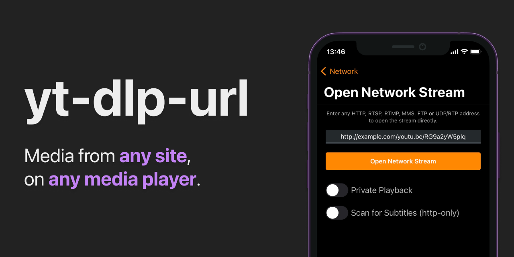

# yt-dlp-url

Creates a URL endpoint to retrieve direct links to media streams from media sites, for use with media players with no such functionality. Also works with playlists. Uses [yt-dlp](https://github.com/yt-dlp/yt-dlp).



```
https://example.com/<MEDIA URL>
https://example.com/<OPTIONS>/<MEDIA URL>
```

# Requirements

-   Node.js >= 17
-   Python >= 3.6

# Docker

Experimental Docker support.
